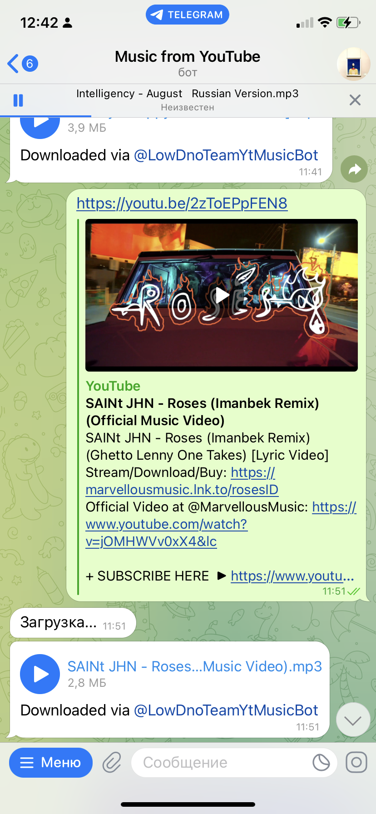

# Music From Video Bot

This Telegram bot can extract .mp3 audio from YouTube video and send it to you.

All you need to do is send him a link.

# Installation

1. Create .env file in the project directory and put the following in it:

   *TG_BOT_TOKEN=your token*
2. Run *make build-image*
3. Run *make start-container*
